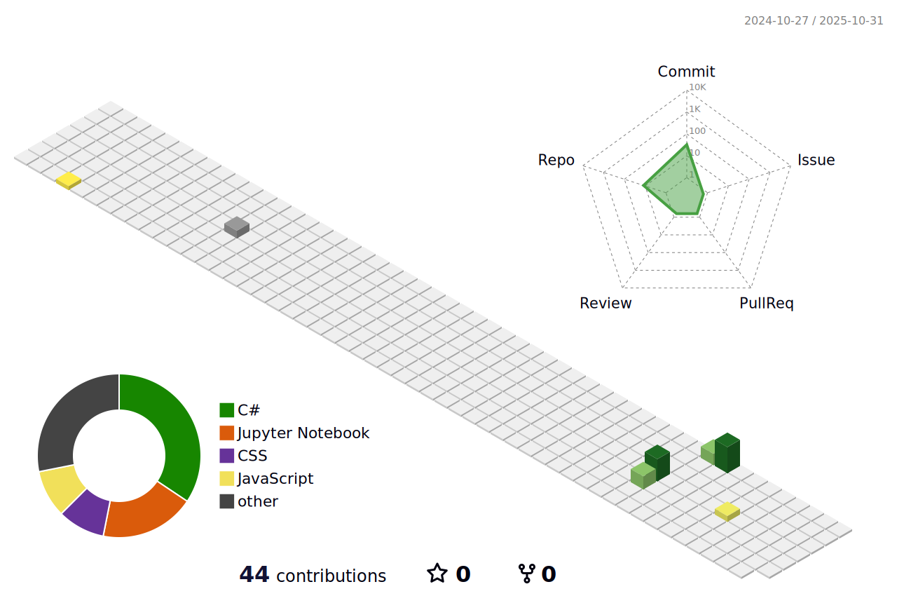

<!---->
 

  
 

<!--<h2 align="center">-->
<!--</h2> -->

 

<!-- %7C -> alttaki yaziya | eklememize yariyor -->

<!--   
<h3 align="left">Skills: Java | Selenium | JUnit | TestNG | Cucumber | Git - GitHub | Html - Css | JIRA | PostgreSQL | LAMBDA | JDBC | API | </h3>
 -->

## <b> Languages and Tools:</b>

  
  
  
  
  
  
  
  

 

 
 
<!-- Contact & Social Links -->

  <!-- LinkedIn -->

  <!-- Gmail -->
  

  <!-- Instagram -->
  

 

 
 
##  <b>My Stats</b>

 
  
  

<!-- -->

